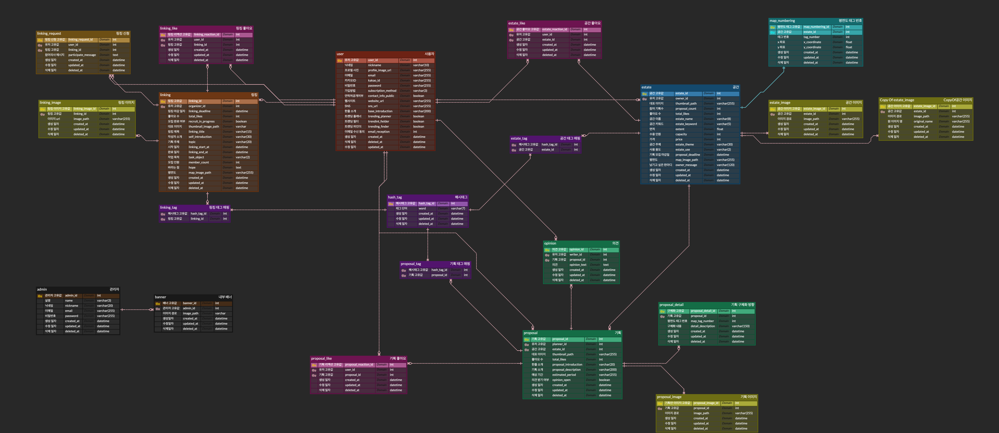

  

## Summary
나만의 기획으로 새로워지는 공간/팝업 문화 플랫폼, `FOLLOCA`입니다.

공간 소유자, 기획자, 일반 사용자 간의 교류를 통해 양방향 소통을 증진하고, '공간 기반 창의적 결과물'의 산출과 실현을 위한 인사이트 공유의 장이 목표입니다.
이를 통해 공간/부동산 소유자들은 공간 제작과 활용에 부담감을 덜고, 기획자들은 자신만의 기획 아이디어를 세상에 공개하고 시장 반응을 확인할 수 있는 기회 창출을 기대합니다.

 

## Project goals

- 협업에 용이하도록 구조화 되며, 확장에 열려 있는 프로젝트 구조 설계
- 공간, 기획, 링킹 등 도메인별 기능에 최적화한 DB 설계
- 실시간 조회 속도를 높이기 위한 In-memory 데이터 구조 및 캐시 서버의 활용
- SMTP를 사용한 이메일 본인 인증 구현
- Multipart/form-data 전송 객체를 활용해 JSON + File 데이터를 전송하는 API 최적화
- PO, 디자이너와의 협업 및 다양한 요구사항을 비즈니스 로직으로 실현

 

## Stack

         

 

## Database - [ERD](https://www.erdcloud.com/d/XYgJzzaQqemMsiprQ)

  

 

## Architecture

- 소프트웨어 시스템을 여러 레이어로 나누고, 각 레이어 간에 명확한 인터페이스를 두어 서로 의존성을 낮추는 `계층형 아키텍처(Layered Architecture)` 적용
- 각 레이어는 독립적이고, 레이어 간의 인터페이스가 명확하게 정의
- `Controller Layer - Service Layer - Data Access layer`로 분리해 `관심사 분리 법칙(principle of separation of concerns, SoC)` 준수
- 데이터베이스와의 상호작용을 캡슐화하여 데이터베이스와의 의존성을 줄이고, 객체 지향 설계의 원칙을 준수하여 유지보수성을 높일 수 있는 `Repository 패턴` 도입
- 높은 응집도, 낮은 결합도, 코드의 재사용성, 데이터베이스 변경의 용이성 고려

 

## Features

### Auth
- GET `/api/auth/redundancy` 이메일 중복 확인
- GET `/api/auth/forgot-password` 비밀번호 찾기
- GET `/api/auth/verification` 이메일 인증번호 발송
- GET `/api/auth/number-check` 인증번호 검수
- POST `/api/auth` 회원가입
- POST `/api/auth/login` 로그인
- POST `/api/auth/kakao/callback` 카카오 로그인 콜백
- POST `/api/auth/google/callback` 구글 로그인 콜백
- POST `/api/auth/oauth` OAuth 가입
- POST `/api/auth/refresh-token` 토큰 재발급
- DELETE `/api/auth/logout` 로그아웃
- DELETE `/api/auth/withdrawal` 회원 탈퇴

### Users
- GET `/api/users` 닉네임 랜덤 추천
- GET `/api/users/nickname/check` 닉네임 중복 검사
- GET `/api/users/edit` 회원정보 수정 페이지 기본 데이터 조회
- GET `/api/users/profile` 프로필 대시보드 & 작성한 글 조회
- GET `/api/users/profile/likes` 프로필 대시보드에서 유저의 좋아요 기록 조회
- GET `/api/users/profile/opinions` 프로필 대시보드에서 유저가 보낸 의견 조회
- GET `/api/users/profile/recent` 프로필 대시보드에서 유저가 최근 조회한 게시글 조회
- PATCH `/api/users/nickname` 닉네임 변경
- PATCH `/api/users/edit` 회원정보 수정
- POST `/api/users/password/check` 현재 비밀번호 일치 확인

### Estates
- GET `/api/estates/popularity` 공간 리스트 인기순 조회
- GET `/api/estates` 공간 리스트 필터별 조회
- GET `/api/estates/{estateId}` 공간 상세 조회
- POST `/api/estates` 새 공간 등록
- POST `/api/estates/like` 공간 좋아요/취소
- DELETE `/api/estates` 공간 삭제

### Proposals
- GET `/api/proposals/trending` 기획안 리스트 트렌드순 조회
- GET `/api/proposals` 기획안 등록 시 등록 페이지 데이터 조회
- GET `/api/proposals/{proposalId}` 기획안 상세 조회
- POST `/api/proposals` 새 기획안 등록
- POST `/api/proposals/like` 기획안 좋아요/취소
- POST `/api/proposals/opinion` 의견 작성
- PATCH `/api/proposals` 기획안 수정
- DELETE `/api/proposals` 기획안 삭제

### Searches
- GET `/api/searches` 태그 검색 결과 목록 조회